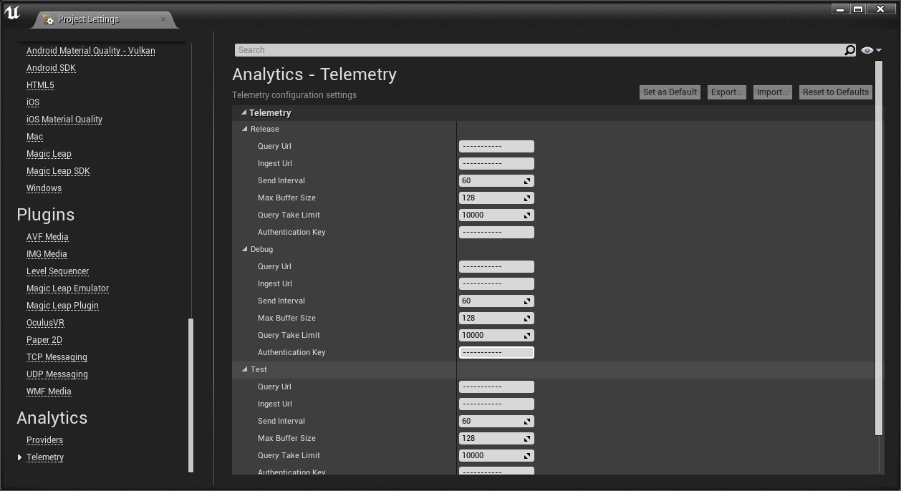
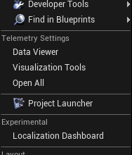
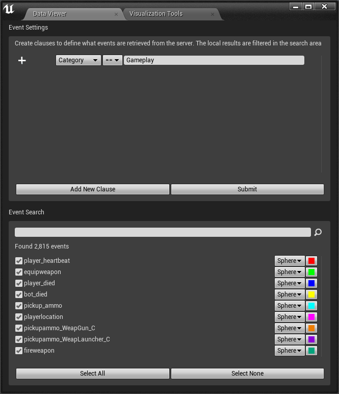
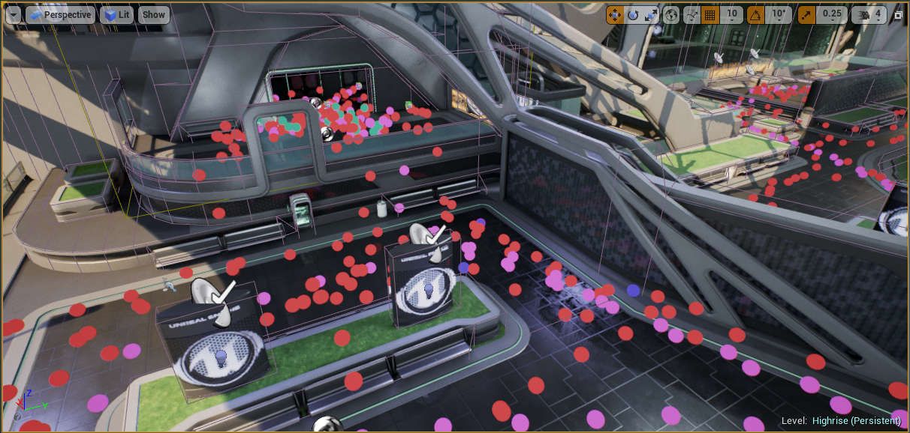
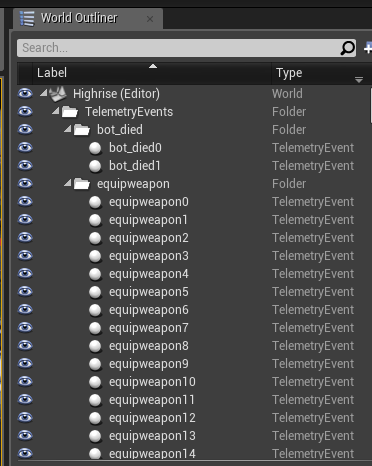
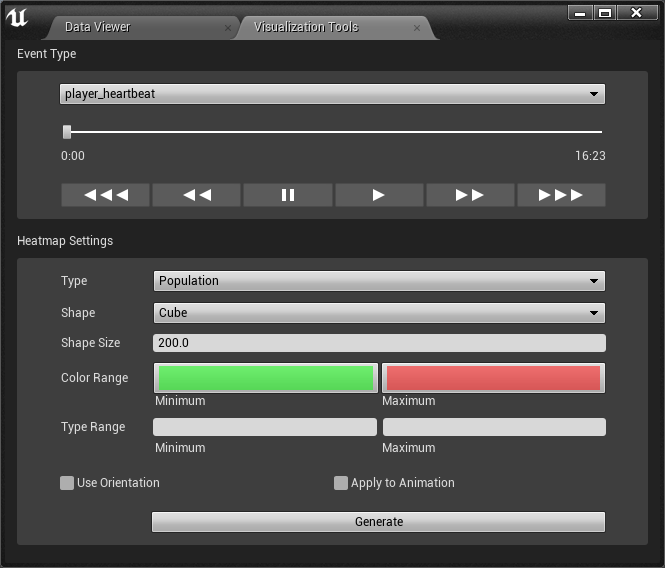
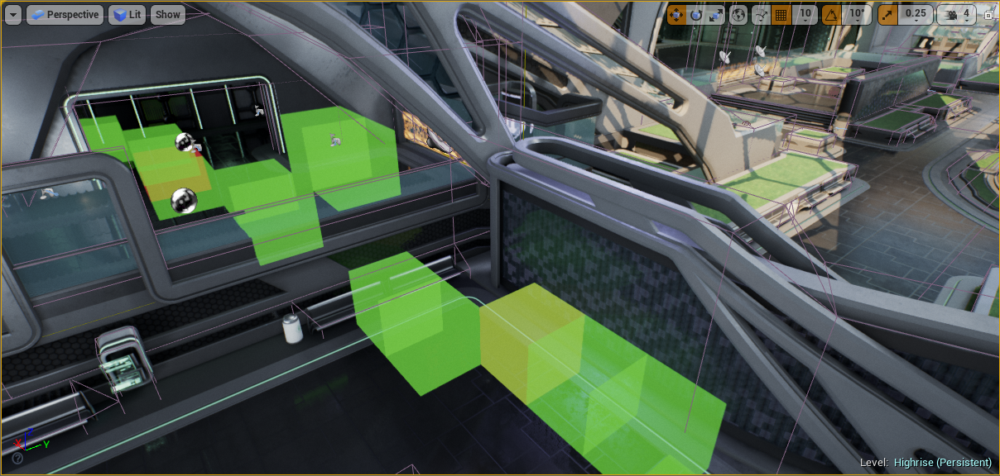

# Adding Game Telemetry to your project
Note that all examples given are when working with the Shooter Game example project

## Setup
1.	If it does not already exist, create a directory called **Plugins** where your uproject is located.

2.	Copy the **Game Telemetry** folder into that directory.

3.	Open your uproject file in a text editor

    a.	Locate the section labeled **Plugins**
    
    b.	Add the following inside of the brackets:
```json
{
    "Name": "GameTelemetry",
    "Enabled": true
},
```
4.	Right click on your uproject and select **Generate Visual Studio project files**

5.	Locate the .build file associated with your game’s source code.

Example:
```
 For ShooterGame, the build file is located at Source/ShooterGame/ShooterGame.build
 ```

6.	In the **PrivateDependencyModuleNames**, add **"GameTelemetry"**

7.	Build the game

8.	Add the telemetry endpoint settings using one of these two methods:

    a.	In editor:
    
    +	Go to **Edit->Project Settings**
       
    +	In the left pane, scroll down to **Analytics**
        
    +	Select **Telemetry** and enter your settings
    
    
    
    b.	Or manually:
        
    + In the project’s “Config” directory, create a file called GameTelemetry.ini and add the following:
```ini
[GameTelemetry]
QueryUrl="[Your query URL]"
IngestUrl="[Your ingest URL]"
SendInterval=60 (interval in seconds when events are sent)
MaxBufferSize=128 (max number of events in each interval)
QueryTakeLimit=10000 (max number of events that the query will acquire)
AuthenticationKey="[Your auth key]"
```

Your project is now ready for game telemetry.

 ---
## Adding events
1.	Once the Game Telemetry module is built in to your game, you can access the recording interface by just adding the header **TelemetryManager.h**

2.	Locate a place in your project’s source where you would like to initialize the Game Telemetry plugin so that it will be available to record events.  To initialize the plugin with a default configuration, just add 
```cpp
FTelemetryManager::Initialize(FTelemetryManager::GetConfigFromIni())
```
Example:
```
 For ShooterGame, this was in UShooterGameInstance::Init().
```

3.	Now that the plugin has been initialized, you are free to add events.  While any event attribute can be overwritten, the following are populated automatically in the plugin based on information available to the engine:

    + Build Type
    + Platform
    + Client ID
    + Client Timestamp
    + Session ID
    + Build ID
    + Process ID
    + Sequence ID

4.	Use FTelemetryBuilder to assign properties to your event

Example:
```cpp
FTelemetryBuilder Builder;
Builder.SetProperties({
	FTelemetry::Position(Pawn->GetActorLocation()),
	FTelemetry::Orientation(rotator.Vector())
	FTelemetry::Value(L"health", MyHealth),
	});
```

5.	Record the event, providing the required name, category, event version, and your properties

Example:
```cpp
FTelemetry::Record(L”my_health”, L”Gameplay”, L”1.3”, MoveTemp(Builder));
```
With that, your event will be sent with the next batch send (set by SendInterval during setup)

---
## Making your events visualizer friendly
While you can record any event you want, the ability to view it using the GameTelemetry plugin requires a couple of settings:

1.	The position of the event is required in order to know where the event can be drawn.  Orientation is also supported

Example:
```cpp
FTelemetry::Position(Pawn->GetActorLocation())
FTelemetry::Orientation(rotator.Vector())
```

2.	Values need specific names in order for the visualizer to recognize them

    + For percentages, either prefix your property with “pct_” or use the construction shortcut Percentage.  This will let the visualizer know that the value is a float between 0 and 100.
   
    + For all other values, prefix your property with “val_” or use the construction shortcut Value.

Example: 
```cpp
FTelemetry::Percentage(L”health”, MyHealth)
```

Example:
```cpp
FTelemetry::Value(L”health”, MyHealth)
```

A final, visualizer friendly event might look something like this:
```cpp
FTelemetryBuilder Builder;
Builder.SetProperties({
	FTelemetry::Position(Pawn->GetActorLocation()),
	FTelemetry::Orientation(rotator.Vector()),
	FTelemetry::Value(L"health", MyHealth),
	});

FTelemetry::Record(L”Health”, L”Gameplay”, L”1.3”, MoveTemp(Builder));
```

---
## Using the visualizer
Once you have data uploaded, you are ready to start visualizing it!

1. In the UE4 editor, open your project.
2. Open the **Window** menu and under **Telemetry Settings**, select **Open All**

    

3. Two tabs will open, **Data Viewer** and **Visualization Tools**.  Note that these can be docked anywhere in the editor or combined within windows.

### Data Viewer

4. First, we will use the **Data Viewer** tab to get our first dataset.  Using the *Event Settings* box, build a query for what general events you would like to recieve.  Once you are ready, press **Submit** and wait for the results.  If the query found events, you will see them populate in the *Event Search* box.
    
    

5. By default, all data received by the query will be enabled.  In the *Event Search* box, you can uncheck any event groups you do not wish to see and use the search bar above to look for different event names.  In addition, each event group has a changeable color and shape for how each event is drawn.
6. You should now have events being drawn directly in your game world.  Use the different shapes and colors to customize your view to see the most relivant information.  Also note that using shapes such as the cone will provide orientation detail as well.
    
    

7. All of the events are actually interactive elements in the game.  They can be clicked to see further details, zoomed, saved, and more.  In the **World Outliner**, just look for actors under the **TelemetryEvents** folder.
    
    

### Visualization Tools

8. Now we will use the **Visualization Tools** tab to get unique views of our data.  In the *Event Type* box, you will noticed a drop down menu.  Expanding that will provide a list of event types, the same from the *Event Search* box on the other tab.  Select one of those event groups.

    

9. You will notice that underneith, a time will now be at the end of our animation bar.  This is the elapsed time of the selected data selected.  Simply press any of the play/rewind buttons or drag the bar to any location in the timeline to see how your data has changed over time.  Points will appear or disappear as if they were happening in realtime.
      
       Note: If there is a gap in time greater than 30 seconds, the animation will skip ahead to keep the visualization more fluid
10. Now lets look at the *Heatmap Settings* box.  Here, you can select a variety of options to combine your event data in to a 3D map and even watch that collection of data animate over time.

    

11. Values represents the group of values you would like the heatmap to use.
12. Type represents the type of heatmap you would like to generate.
    + *Population* combines events into physical groups and displays a heatmap of the number of each event within a given group.
    + *Population - Bar* does the same, but generates a 3D bar graph over the XY plane.
    + *Value* also combines events into physical groups, but displays a heatmap of the average of the value of each event within a given group.
    + *Value - Bar* provides a 3D bar graph of value information.
13. Shape and shape size represent the shape of the heatmap elements along with their radius.  The smaller the radius, the more detailed the information (though also the more complex the heatmap is to generate).
14. The color range provides the color for the minimum and maximum values in the map.  Colors in between are a fade between the two colors chosen.
15. Type range will populate when you generate the heatmap, but can be used to adjust the colors.  This can be helpful when your data has outlying values that can cause the heatmap to lack variability.  Adjust the range to remove extreme highs and lows to get more interesting information.
16. Use Orientation will rotate the heatmap shapes to the average orientation of all events within each element.
17. Apply to Animation will allow the animation controls above control animating the entire heatmap
